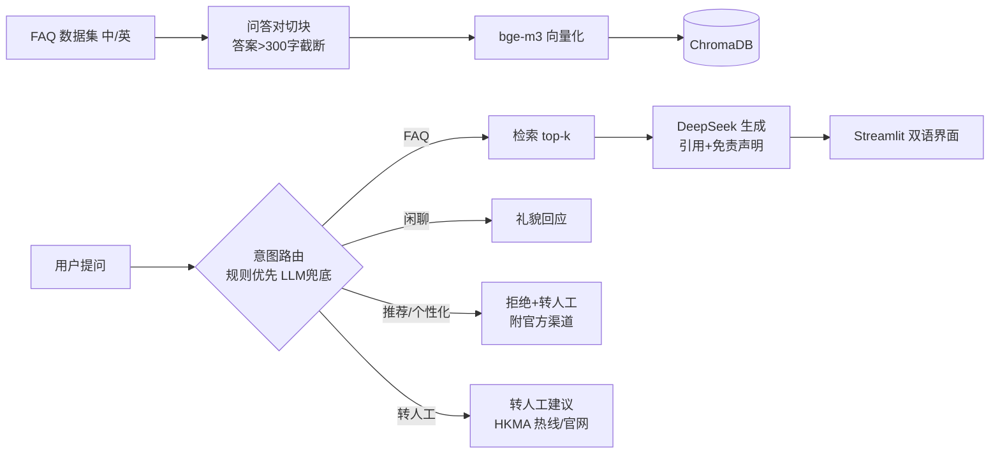

# PRD：香港金融消费者双语问答助手

## 1. 背景与问题

香港金融消费者获取开户、收费、转账、理财、保险/MPF、防骗等信息时，资料分散在 IFEC 钱家有道、HKMA 智醒消费者等多个官方站点，中英页面并存，检索成本高。教育类问答需要可溯源的官方依据，不能做成投资建议或代客操作。本项目用官方消费者教育资料构建中英双语 RAG 问答助手，回答带来源引用与免责声明，作为两周可演示的作品集项目。

## 2. 目标用户与场景

- 演示用户：香港金融消费者（留学生、新移民、本地居民）自助查询开户文件、存款保障、信用卡、收费转账、理财概念、保险/MPF、防骗。
- 简历视角用户：AI PM 招聘方——项目证明数据治理、检索与幻觉控制、红线路由、held-out 评测方法论。

## 3. 产品目标与成功指标

与设计文档 §1 一致：

- 数据集 42 条中英 Q&A（官方教育资料 + 演示自编），全部带来源与收录日期，覆盖 ≥6 类主题。
- held-out 测试集 23 题（t01–t20 FAQ，10 中 10 英；n01–n03 负例）。
- 指标目标：Top-3 检索召回 ≥85%；回答准确率 ≥80%（部分正确计 0.5）；faithfulness ≥0.85（人工判定）；p95 延迟 ≤5s（题目 × 5 次运行）；编造率 = 0。
- 全程 DeepSeek token 成本 ≤¥20；GitHub 可公开，含 PRD、README、评测报告、demo。

## 4. 功能需求

- F1 双语问答：中英提问，基于 FAQ 检索 + DeepSeek 生成。
- F2 来源引用：回答标注来源编号，界面列出 source 与主题。
- F3 四分类路由与红线拒绝：faq / chat / recommend_refuse / escalate；推荐类问题一律拒绝并转介持牌机构。
- F4 转人工与官方渠道：投诉/人工关键词及空检索（L2 距离 > 0.65）返回 HKMA 热线 (852) 2878 1111 与官网。

## 5. 非功能需求

- p95 延迟 ≤5s；编造率 = 0；成本 ≤¥20。
- 本地可跑：Python 3.10+、bge-m3 本地 embedding、ChromaDB、Streamlit。
- 密钥只存 `.env`，不入库。

## 6. 数据需求与治理

- 唯一数据文件 `data/faq.txt`：字段 q_zh / a_zh / q_en / a_en / source / date / topic，`---` 分条。
- 验收 4 规则：来源 URL+日期；短引用≤100 字+改写；主题≥6 类；中英对齐，总量 40–42 条。
- 版权：官方内容短引用+改写，不逐字大段复制；`data/README.md` 写明 IFEC/HKMA 出处。
- 更新：改 `data/faq.txt` → `python scripts/build_index.py --reset`。

## 7. 架构概述

```
FAQ(中英) → 问答对切块 → bge-m3 向量化 → ChromaDB 索引
用户提问 → 意图路由(FAQ/闲聊/推荐类拒绝/转人工) → 检索 top-k（L2≤0.65）→ DeepSeek 生成(带引用+免责) → Streamlit 双语界面
```



技术栈：Python 3.13.5 ｜ LangChain ｜ ChromaDB ｜ bge-m3（HF 镜像）｜ DeepSeek deepseek-chat ｜ Streamlit。

## 8. 评测方案

- 测试集：`eval/testset.csv` 23 题 held-out（语料外改写问法）+ 推荐拒绝/OOS 负例。
- 自动指标：`eval/run_eval.py` 计算 Top-3 召回、p95 延迟、红线合规（推荐必须拒绝、OOS 必须转人工）。
- 人工指标：`eval/labels.csv` 双人标注准确率（正确/部分正确/幻觉）与 faithfulness。
- 检索阈值：`RETRIEVAL_MAX_DISTANCE = 0.65`（Task 6.1 定 0.6；Task 9 三档实验 0.6/0.65/0.70 → 召回 90%/95%/95%，2026-08-19 DSH 裁决定 0.65：达标且更保守）。

### 8.1 最终评测结果（2026-09 收尾定稿）

自动指标（`eval/run_eval.py`，0.65 定稿版，复验输出见 `eval/report.md`）：

- Top-3 检索召回：**19/20（95.0%）**，目标 ≥85% ✅
- 红线合规（推荐拒绝 / 无检索不编造）：**通过** ✅
- p95 延迟：**≈5.09s**（DSH 复验轮），目标 ≤5s、贴线接受；受 DeepSeek API 第三方网络波动影响，三次独立运行 p95 = 4.06s / 7.03s / 5.09s（波动带约 4–7s），平均延迟 3.98–4.17s，主体体验 4s 级

人工指标（`eval/labels.csv` 双人标注 final 列，2026-08-23 DSH + 用户定稿）：

- 口径：20 个 FAQ 题（t01–t20）三档加权计准确率（正确 1 / 部分正确 0.5 / 错误 0）；faithfulness 二档判定（无编造 1 / 有编造 0）；负例 n01–n03 按行为合规口径另行判定，不并入上述得分
- 回答准确率：**50%**（(7×1 + 6×0.5) / 20），目标 ≥80% ❌
- faithfulness：**40%**（8/20），目标 ≥85% ❌
- 边界案例（如实记录，口径已定稿，含幻觉治理边界）：①「资料未说明/未列出」句式语义绕过 5 题（t01/t03/t10/t11/t13，其中 4 题记 0 分）；② 金额先验数字幻觉 2 题（t08/t17，答 50 万 ≠ 资料 80 万）；③ t09 口语改写致检索失败转人工，acc 记 0（检索失败 ≠ 编造，行为合规口径）；④ 来源外事实正确补充 4 题（t05/t06/t15/t20），acc 不扣、faith 扣

结论：**自动指标全部达标、人工指标显著未达标**（prompt 约束四层尝试后「资料未说明」语义绕过与数字先验幻觉仍残留）。如实入档、不改指标定义——作为评测方法论（held-out 双人标注）与幻觉治理边界素材，逐题分歧与裁决见 STATUS.md「双人标注定稿」。

## 9. 风险与合规

- 三处统一免责声明：演示用途、可能过时、不构成投资建议。
- 投资建议红线：关键词路由直接拒绝，不调用生成。
- 版权：短引用+改写+链接+收录日期；页面快照在 `data_snapshots/`（不入 git）。
- 密钥泄露：revoke → 换 key → 清 git 历史。

## 10. 里程碑

> 数据集与评测均提前完成，8 月中下旬已定稿；下表「实际日期」依据 STATUS.md 的提交与验收记录更新。

| 阶段 | 计划日期 | 实际日期 | 内容 | 完成标准 |
|---|---|---|---|---|
| D1–2 | 8/15–16 | 8/15–16 | 环境、venv、DeepSeek ping、repo | hello 对话成功 |
| D3–6 | 8/17–20 | 8/16–17（提前） | 42 条数据收集与复核 | 数据过验收 4 规则；抽查 10 链接可打开 |
| D7–8 | 8/21–22 | 8/16（提前） | 索引 + RAG + Streamlit（Task 3–7、6.1） | 端到端 6 用例截图验收 |
| D9–10 | 8/23–24 | 8/16–17（提前） | 路由 + held-out 测试集 23 题 + 基线 | 基线出炉（召回 80%、红线通过） |
| D11–12 | 8/25–26 | 8/18–23（提前） | 优化实验与双人标注评测 | 阈值 0.65 定稿（召回 95%）；双人标注 final 8/23 定稿 |
| D13 收尾 | 8/27 | 9/6（本批次） | PRD/README 定稿、临时文件清理、.env 检查、tag v1.0.0 | 交付物全绿 |
| D14 缓冲 | 8/28 | 未启用 | 缓冲 + 面试准备 | 主体提前完成，缓冲日未使用 |
